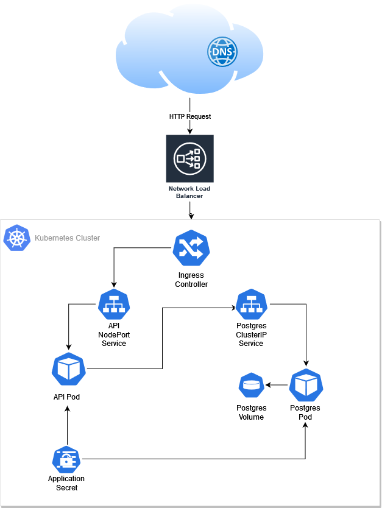

# Hello-API Kubernetes Deployment
This directory contains the Kustomize deployment of the Hello-API on
Chaz's Kubernetes Cluster.  
This project should be usable in any cloud provider, provided that your
Kubernetes Cluster has an Ingress Controller and Storage Class configured.  
  
This API is available in production at https://hello.chaz.pro

## Usage
Provide the `secrets.yml` file and apply it to the cluster:

```
---
kind: Secret
metadata:
    name: hello-secret
type: Opaque
stringData:
    DB_USER: ...
    DB_PASSWORD: ...
    DB_NAME: ...
    DB_URI: ...
```  

Provide a PV and PVC to be mounted by the Postgres Pod.  

Set-up your DNS records for the application, then edit `ingress.yml` to reflect your configuration.  

Apply this Kustomize directory to your cluster:

```
$ kubectl apply -k k8s/
```  
  
An `Application` ArgoCD CRD is available to automate the deployment procedure.
  
## System Overview Diagram  
  
